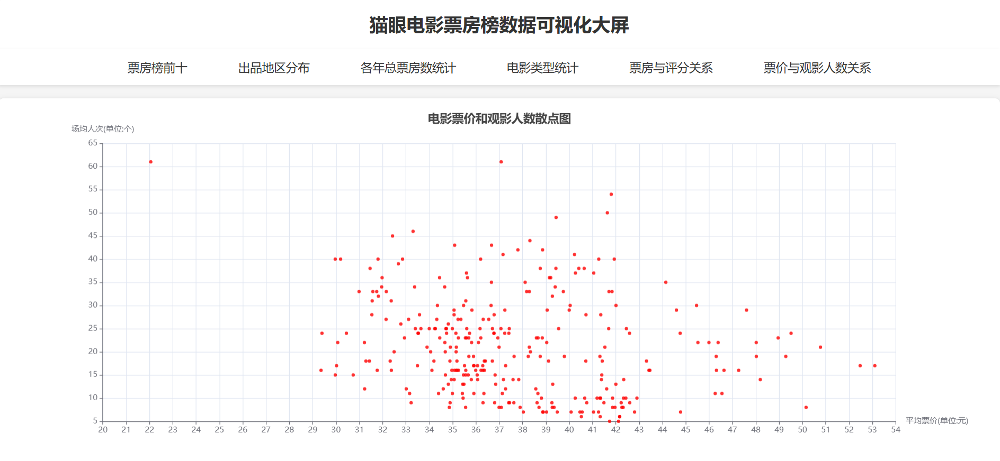
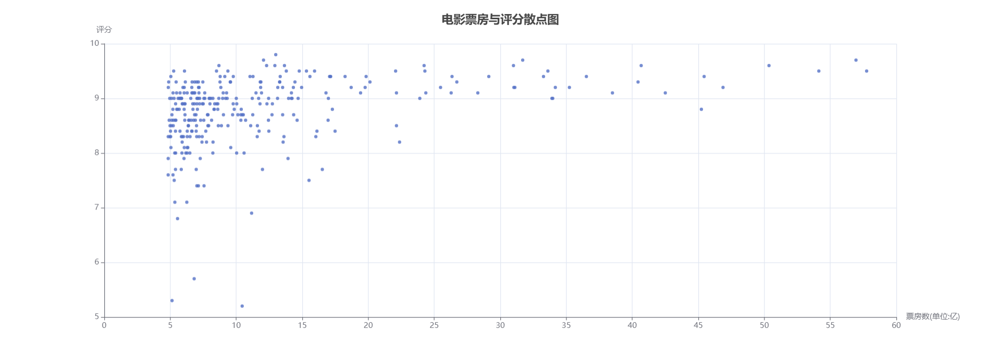

# 项目简介
使用**requests**和**BeautifulSoup**爬取[猫眼票房榜信息](https://piaofang.maoyan.com/rankings/year)  
包括电影的名字、上映时间、评分、票房、平均票价、电影详细信息链接、电影标签、出品地区  
使用**pyecharts**将爬取到的数据生成可视化图表，最后将图表组成数据可视化大屏

### 项目预览
#### 在线预览
__[预览地址](https://myksh.pages.dev)__ 
#### 图表图片
__电影票房排行柱状图__
  
__各年票房总和折线图__

__电影和观影人数散点图__

__票房与评分散点图__

__电影标签词云图__

__电影类型饼图__

__电影出品地地图__

